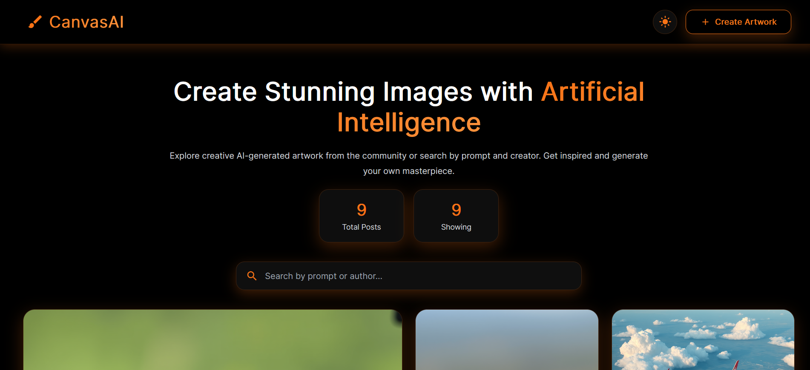
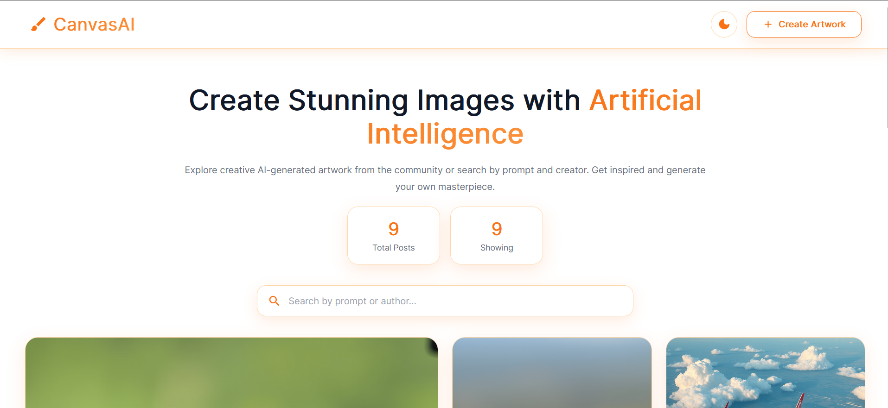
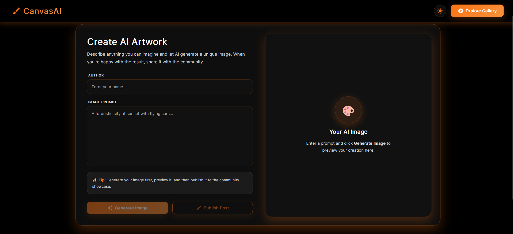
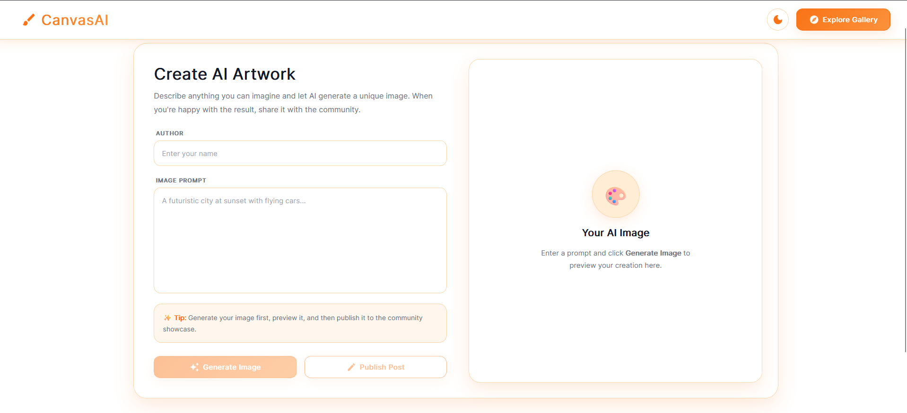
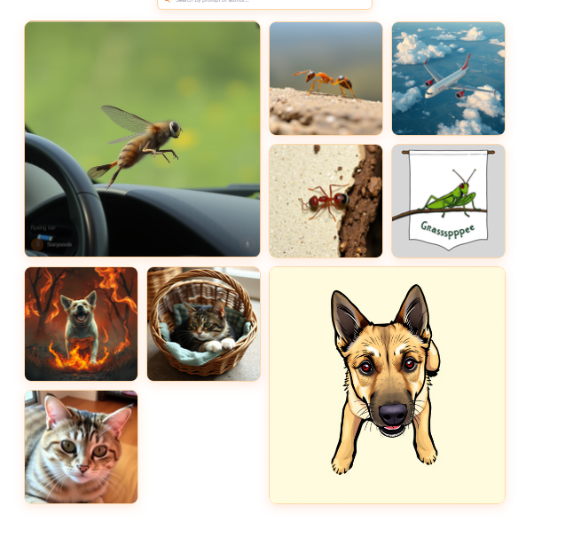
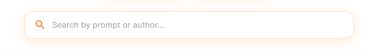

# CanvasAI

CanvasAI is a full-stack AI-powered image generation platform that transforms natural language prompts into AI-generated artwork. Users can create images, preview the generated results, publish them to a community gallery, search existing creations, and download artwork through a modern and responsive interface.

The project follows a client-server architecture with a React frontend and a Node.js/Express backend, providing a seamless image generation and sharing experience.

## Live Demo

https://canvasai-createandshowcase.netlify.app/

---

# Features

- AI-powered image generation
- Community gallery
- Publish generated artwork
- Search by prompt or creator
- Image download
- Dark and Light themes
- Responsive design
- Modern UI with smooth animations
- REST API integration

---

# Application Preview

## Home Page

### Dark Mode

<p align="center">

</p>

### Light Mode

<p align="center">

</p>

---

## Create Artwork

Generate AI images from custom prompts and publish them to the community.

### Dark Mode

<p align="center">

</p>

### Light Mode

<p align="center">

</p>

---

## Community Gallery

Browse artwork published by all users.

<p align="center">

</p>

---

## Search Feature

Search instantly by creator name or image prompt.

<p align="center">

</p>

---

## Theme Toggle

Switch between Dark Mode and Light Mode.

<p align="center">

</p>

---

# Technology Stack

## Frontend

- React
- Vite
- Styled Components
- React Router DOM
- Axios
- Material UI
- File Saver
- React Lazy Load Image Component

## Backend

- Node.js
- Express.js
- MongoDB
- Mongoose
- Cloudinary
- Axios
- Dotenv
- CORS

---

# Project Structure

```text
Generate_Image_FullStack_Project
│
├── Backend
│
├── Frontend
│
├── screenshots
│   ├── create-dark.png
│   ├── create-light.png
│   ├── gallery.png
│   ├── home-dark.png
│   ├── home-light.png
│   ├── search-bar.png
│   └── theme-toggle.png
│
└── README.md
```

---

# Architecture

```text
                    User
                      │
                      │
             React Frontend
                      │
                Axios Requests
                      │
              Express REST API
              ┌────────┴────────┐
              │                 │
        AI Image Service     MongoDB
              │
              │
          Cloudinary
```

---

# Installation

## Clone Repository

```bash
git clone https://github.com/Suryansh-Soni/Generate_Image_FullStack_Project.git
```

---

## Frontend

Navigate to the frontend folder.

```bash
cd Frontend
```

Install dependencies.

```bash
npm install
```

Run the development server.

```bash
npm run dev
```

---

## Backend

Navigate to the backend folder.

```bash
cd Backend
```

Install dependencies.

```bash
npm install
```

Start the server.

```bash
npm start
```

or

```bash
npm run dev
```

---

# Environment Variables

Create a `.env` file inside the Backend directory.

```env
PORT=8080

MONGODB_URL=YOUR_MONGODB_CONNECTION_STRING

OPENAI_API_KEY=YOUR_API_KEY

CLOUDINARY_CLOUD_NAME=YOUR_CLOUD_NAME
CLOUDINARY_API_KEY=YOUR_API_KEY
CLOUDINARY_API_SECRET=YOUR_API_SECRET
```

Replace the AI API key variables according to the AI provider used by your backend.

---

# API Endpoints

| Method | Endpoint             | Description                    |
| ------ | -------------------- | ------------------------------ |
| POST   | `/api/generateImage` | Generate an AI image           |
| POST   | `/api/post`          | Publish artwork                |
| GET    | `/api/post`          | Retrieve all published artwork |

---

# User Workflow

1. Enter your name.
2. Write a detailed prompt.
3. Generate an AI image.
4. Preview the generated artwork.
5. Publish the artwork.
6. Explore the community gallery.
7. Search by prompt or creator.
8. Download any artwork.

---

# Available Scripts

## Frontend

| Command         | Description              |
| --------------- | ------------------------ |
| npm run dev     | Start development server |
| npm run build   | Build production version |
| npm run preview | Preview production build |
| npm run lint    | Run linter               |

## Backend

| Command     | Description              |
| ----------- | ------------------------ |
| npm start   | Start production server  |
| npm run dev | Start development server |

---

# Deployment

## Frontend

Hosted on Netlify

https://canvasai-createandshowcase.netlify.app/

## Backend

Suitable for deployment on:

- Render
- Railway
- Azure App Service
- AWS Elastic Beanstalk
- DigitalOcean App Platform

---

# Future Enhancements

- User authentication
- User profiles
- Image history
- Favorites
- Prompt suggestions
- AI image editing
- Advanced search and filters
- Pagination
- API documentation
- Docker support
- Automated testing
- Continuous Integration and Deployment

---

# License

This project was developed for educational purposes and as part of a software development portfolio. It is intended for learning, experimentation, and demonstration of full-stack development skills.
